# ReadMe
This is a little project for a small community library.

## Table of Contents
- [Background](#background)
- [Install](#install)
- [Usage](#usage)
    - [Public Interface](#Public-Interface)
    - [Staff Interface](#Staff-Interface)

## Background
A small community library with a few branches has approached me to develop a system that will 
allow it to manage members (borrowers) and book loans that they make.
There should be two interfaces with functional requirements:
1. [**The public interface**](#Public-Interface), not requiring any identifying information to be entered, should allow borrowers to search the catalogue to find out which books are available, if they are on loan or not (and if they are when they are due back)
2. [**The staff interface**](#Staff-Interface) is focused on library staff, allowing them to search the book, issue books to borrowers and return books that have been on loan, to check overdue loans, to view borrower's information and record.
3. **The Database** is given,can be seen in folder "MySQL Database". Here is a data model I made to help understanding the SQL in my project.
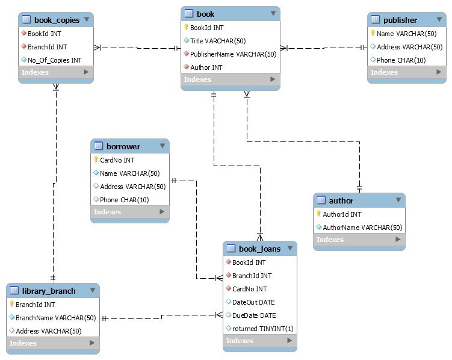 

## Install
This application is based on the MySQL, Python, Flask.

1. Clone the repository. 
2. Run the requirements.txt to build a virtual envirnonment.
3. Build your database on your own server
You can use the scripts inside folder "MySQL Database" to build your database on your own server(AWS or SQL Sever, anywherer you prefer), and then fill in the connect.example.py.
*I removed my connection.py due to the protection of my sensitive data, but you can fill in yours to connect to the database.*
4. Then run the app.py. 
5. Now, you can enter the system through http://127.0.0.1:5000/

### Public Interface
**Route:** 
"/"

**Function:** 
Fuzzy search a book by title and/or author.  
See the availability of a book at each branch, if it is on loan, the due date will be displayed. 
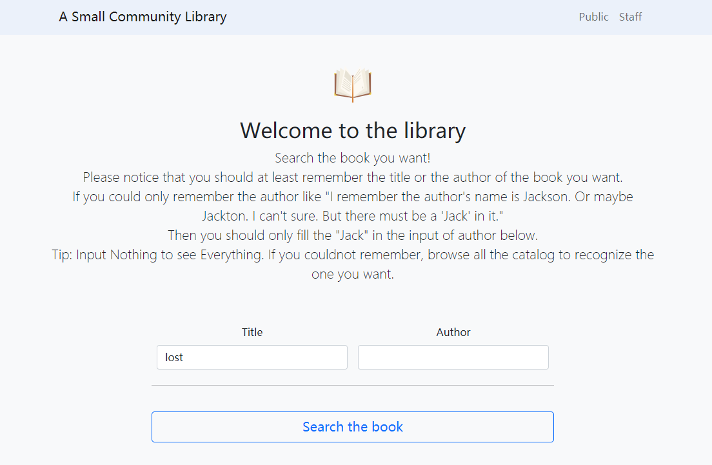
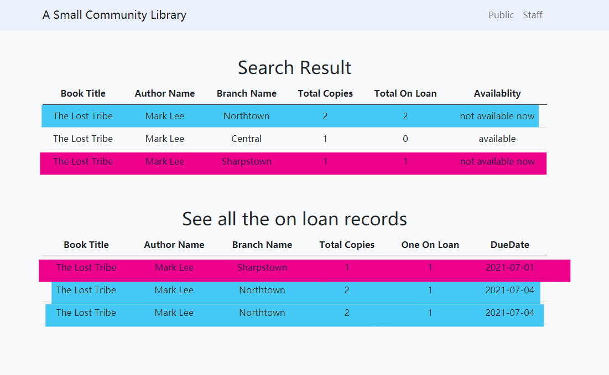 

**Assumptions and Design decisions:** 
I make the public interface a page with function. They can directly do the search on this page following the lead, and the result will appear on this route too. 
The search result is spilted into two parts. 
For most users, the first part "Search Result" will suffice. It's clear to show whether this book is available or not, if not, they can go to other branch where this book is available. 
If they insist on this book, then they scroll down to the second part "See all the on loan records".  
The second part is designed especially for the borrowers who have specific needs, like "I want to borrow several copies from the same branch, one for myself, others for my mates in reading club." They want to know when all the copies are available. It's no help only tell them "The Lost Tribe is available in this branch, and since one is available, I can't tell you the due date of other 3 which has been borrowed." 

**Screenshots for different situations:** 
Normal situation has been showed in above screenshots with two parts. 
If all the copies of this book are available at all branches, then the second part won't appear.  
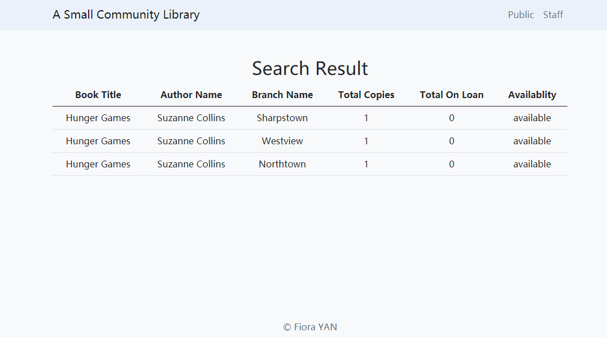 
For users who are not clearly about what they want, just like i said in the public interface,"Input nothing to see everything", just click the button, then view all the catalouge and records to  see what wanted. 
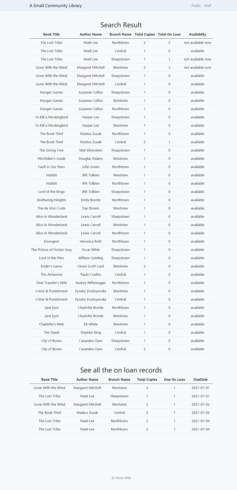 
Of cousre, ther is also a situation to tell "no record".  
I didn't use a custom error page here, because maybe we do not have that book in our library. It is not supposed to be called as the error. Therefore, this page is written in html,if no search result, this section appear. 
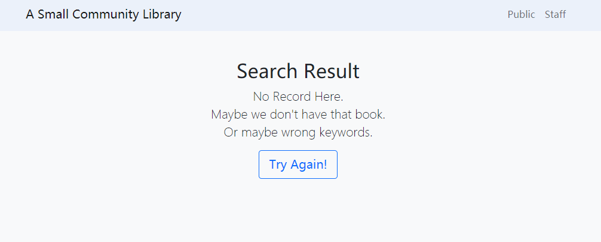 

### Staff Interface
**Route:**
"/staff"

**Function:**
- [search a book](#search-a-book)
- [view the record of a borrower](#view-the-record-of-a-borrower)
- [issue a book](#issue-a-book)
- [return a book](#return-a-book)
- [display overdue books and their borrowers](#display-overdue-books-and-their-borrowers)
    
**Assumptions and Design decisions:** 
As the design of public page, I made staff page the same.  
Staff can do all their work on this page. 
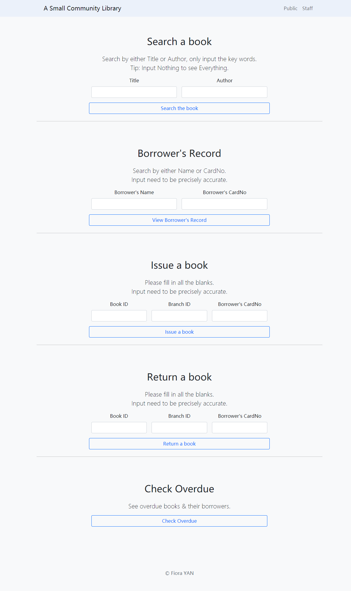 

#### Search a book
This function is samed as the one in public interface, they both return to the "/BookResult" to view the result. 
From the business view, the staff mostly use this function to do the inventory verification, which means the staff need to see all the books at the same time. And they may need to help the borrower to check if the book is available, so the fuzzy research is still needed. 
Since the same function can meet both needs for staff and borrowers, so i just recall it here. 

#### View the record of a borrower
This function is to view the record of a borrower. 
This business scenario often happens when someone want to borrow a book, then the librarian take his card and the book he want to borrow. Then the librarian input the card ID to see if this borrower are allowed to borrow the book, maybe he has overdue loans.  
Or the borrower ask to have a picture of his loans, in this kind of situation, the borrower may not bring the card with him and he can't remember the card ID. One must tell his name correctly to prove that he is a member here, the librian also need to ask for the telephone or address for further check to decide whether to tell him the details of the debt.  
Therefore, this function asks a ID or a name, which are supposed to be precisely correct. And the result data includes the items like personal inforamtion and their loans, especially the status of their loans. 
The result will be displayed at the route "/staff/BorrowerRecord" 

If sucessfully done, then the record will be displayed like below screenshot. 
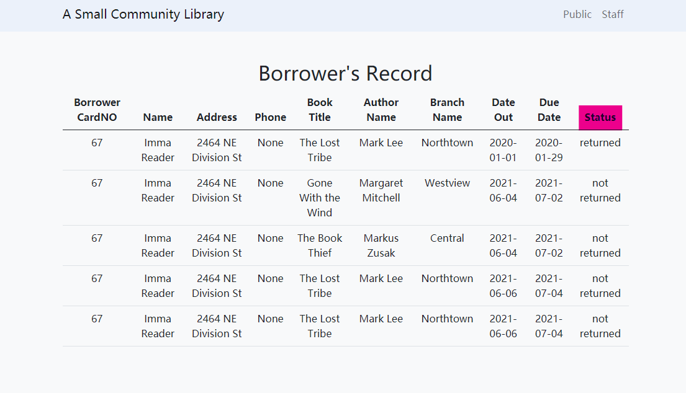 
If failed, then the page will display the hints. 
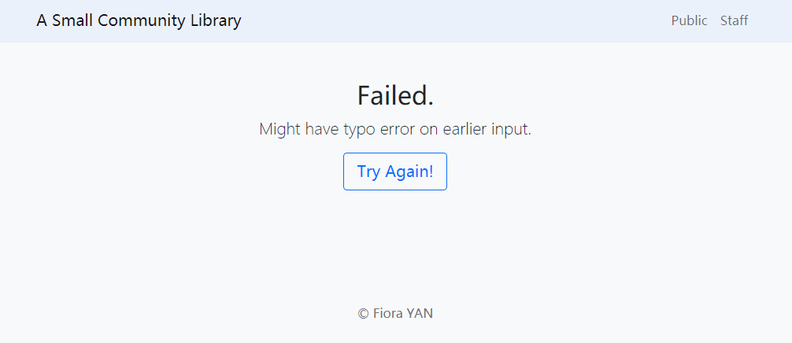 

#### Issue a book
This function requires Book ID, Branch ID, Card ID at same time.  
Normally, the Book ID and Branch ID can be found on the cover of the book. And when borrower want to borrow a book, he need to pass the book and his card to the librarian so the librarian can get the card ID too. 
According to the real business, all the book is issued by current date, and the period is 28 days. So don't need to input these things, it's been set already. 
After issuing a book, record of this borrower on this book which has been lent today from this branch will be displayed for the librarian to check again. 
The result will be displayed at the route "/staff/IssueABook" 

If sucessfully done, then the record will be displayed like below screenshot. 
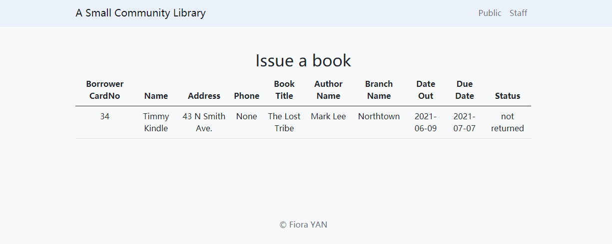 
If failed, then the page will display the hints. 
 

#### Return a book
This function requires Book ID, Branch ID, Card ID at same time as well.  
Normally, the Book ID and Branch ID can be found on the cover of the book. And when borrower want to return a book, he need to pass the book and his card to the librarian so the librarian can get the card ID too. 
After doing this, record of this borrower on this book from this branch which has been returned will be displayed for the librarian to check again. 
The result will be displayed at the route "/staff/ReturnABook" 

If sucessfully done, then the record will be displayed like below screenshot. 
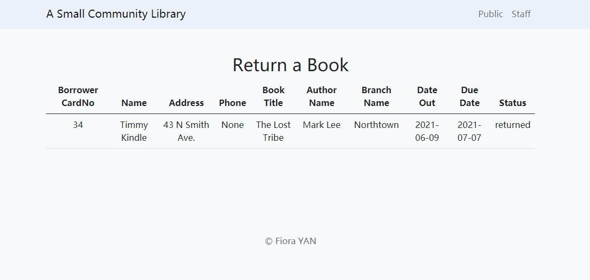 
If failed, then the page will show the hint. 
 

#### Display overdue books and their borrowers
The duedate is yesterday and the book is not returned can be regarded as overdue.  
Take the same name of books and the same name of borrowers into consideration, the author name, branch name, the borrowers' card ID are included.  
The result will be displayed at the route "/staff/Overdue"  

Following this principle, it can automatically generate a list if there are overdue loans.  
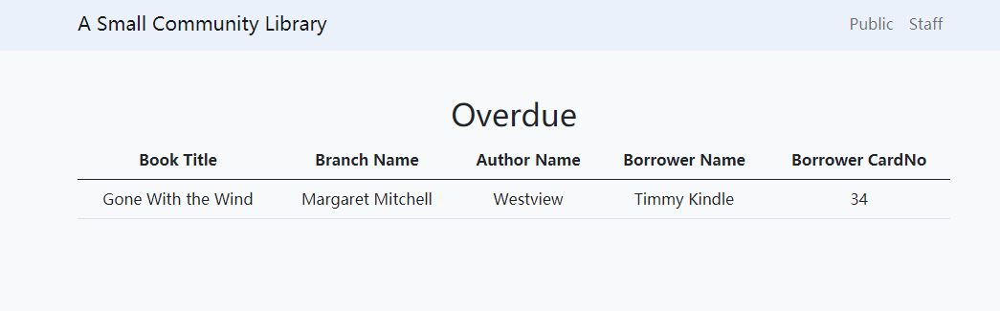 
If there is no, than the good news will be displayed.  
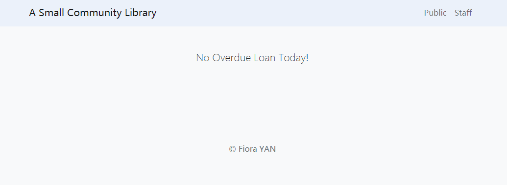 
